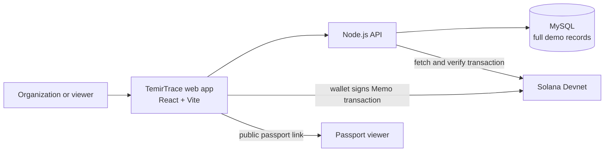

# TemirTrace

**Digital equipment passports with verifiable maintenance records.**

TemirTrace is an early-stage demo for organizations that need a clearer way to share equipment details and service history. Full records stay in the application database; a service-record ID and SHA-256 fingerprint can be published to Solana Devnet as a Memo transaction and checked later.

**MVP · Solana Devnet · Kazakhstan**

[Live demo](https://temir-trace-doooom.vercel.app/) · [GitHub repository](https://github.com/captaindoody/TemirTrace-DOOOOM-)

> **Demo notice:** This is a public prototype with one shared workspace and no user accounts or role-based access. Use fictional data only. Organization review is a manual demo workflow, and BIN validation checks the number format only; neither is an official verification.

## The problem

Equipment ownership details and maintenance records can be spread across documents and service providers. That makes it harder for a new owner or workshop to review an asset's history. TemirTrace explores whether a shared digital passport, paired with a verifiable record fingerprint, can make that history easier to inspect.

This is a product hypothesis; the project has not yet established customer demand or completed a registry integration.

## What the MVP does

- Create an organization profile and submit it to a demo review queue.
- Add equipment and service records to a digital passport.
- Calculate a SHA-256 fingerprint for a service record.
- Connect a Solana Devnet wallet and publish the record ID and fingerprint in a Memo transaction after wallet approval.
- Verify a submitted transaction signature against Solana Devnet and display the public passport.

## How the proof works

1. TemirTrace stores the complete organization, equipment, and service data off-chain in MySQL in the hosted deployment.
2. The browser calculates a SHA-256 fingerprint from selected service-record fields.
3. The connected wallet signs a Solana Devnet transaction containing a Memo in this format:

   ```text
   TEMIRTRACE|v1|<record-id>|<sha256-fingerprint>
   ```

4. The backend fetches the transaction from Solana Devnet and checks that the memo matches the saved record.
5. A viewer can follow the transaction signature to Solana Explorer and compare the public fingerprint.

The memo is a public reference and fingerprint, not the full service record. A matching hash can show that the submitted content matches the anchored fingerprint; it does not prove that the repair happened or that the entered details are true. TemirTrace does not currently use a custom Solana smart contract.

## Why Solana

Solana Devnet provides a public transaction record that a demo reviewer can inspect independently of the TemirTrace database. The prototype uses the Memo program to publish a compact reference and fingerprint. Devnet is for testing: its SOL has no monetary value, and its data may be reset.

## Architecture



## Tech stack

| Layer | Technology |
| --- | --- |
| Frontend | React, Vite, JavaScript |
| Solana client | `@solana/kit`, wallet plugin, Memo program |
| Backend | Node.js API functions |
| Hosted storage | MySQL |
| Local storage | JSON file (`data/store.json`) |
| Hosting | Vercel |
| Blockchain network | Solana Devnet |

## Run locally

Requirements: Node.js 20+ and npm.

```sh
npm ci
npm run build
npm start
```

Open [http://127.0.0.1:8001](http://127.0.0.1:8001). Without database environment variables, the local server stores demo data in `data/store.json`. Install a Solana wallet such as Phantom in the same browser to try the Devnet transaction flow. Use only Devnet funds and fictional records.

## Hosted deployment

The frontend is built into `dist` and served by Vercel. API endpoints are implemented by the files under `api/`. The hosted API requires a reachable MySQL database. Configure the database connection variables in Vercel and redeploy after changing them.

Supported database variables:

- `MYSQL_PUBLIC_URL`, or
- `DB_HOST`, `DB_PORT`, `DB_NAME`, `DB_USERNAME`, `DB_PASSWORD`

Production startup requires MySQL settings. The server initializes its state table automatically; it does not import local JSON data into the hosted database.

Because this demo has no sign-in, all visitors can read and modify the same shared workspace, including review decisions. Do not use real company, personal, or equipment data.

## Demo walkthrough

1. Open the [live demo](https://temir-trace-doooom.vercel.app/).
2. Load the sample data or create a fictional organization profile.
3. Submit the profile to review and use the clearly labelled demo reviewer flow.
4. Add equipment and a service record.
5. Connect Phantom on Solana Devnet and publish the fingerprint. Review the memo and approve it in the wallet.
6. Open the public passport and inspect the Devnet verification status or transaction link.

## Current limitations

- No custom smart contract; the prototype uses the existing Solana Memo program.
- Full records are stored off-chain; only a record reference and fingerprint are sent on-chain.
- No government registry lookup: BIN is checked for format only.
- Review decisions are a manual demo workflow, not independent organization verification.
- No user accounts, organization separation, or moderator permissions.
- No customer traction or demand-validation results are documented in this repository.
- Devnet transactions are test transactions and do not represent production use.

## Possible next steps

These are ideas for future work, not features that are currently shipped:

- Add sign-in, organization-level data separation, and reviewer permissions before using real records.
- Talk with equipment owners and service workshops to test whether shared maintenance passports solve a real problem.
- Explore an authoritative organization-verification source if pilot users need one.
- Revisit a custom Solana program only if the product needs on-chain state or rules beyond a public record fingerprint.

## Repository context

The Git history in this repository begins on October 2, 2026. That history records the current repository, not necessarily every earlier prototype activity. AI coding tools assisted with implementation based on the founder's product goals and instructions. Any work completed before the hackathon period should be disclosed separately in the Colosseum submission.

## Resources

- [Live demo](https://temir-trace-doooom.vercel.app/)
- [GitHub repository](https://github.com/captaindoody/TemirTrace-DOOOOM-)
- [Solana Devnet Explorer](https://explorer.solana.com/?cluster=devnet)
- [Colosseum Crypto World's Fair](https://colosseum.com/worldsfair)
